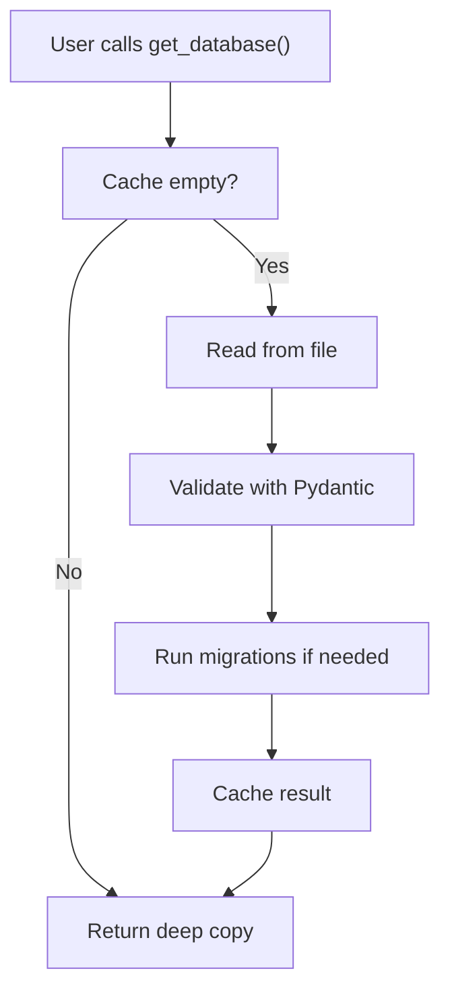

# JsonDatabase Architecture & Design

This document explains the internal design of JsonDatabase, how it works, and how to extend it.

## Design Paradigm

JsonDatabase follows a **typed repository pattern** with managed read-modify-write cycles.

### Core Concepts

**Repository Pattern**: JsonDatabase acts as a typed repository for your data, abstracting away file I/O and validation concerns.

**Type Safety**: All data flows through Pydantic models, ensuring compile-time and runtime validation. You never work with unstructured dictionaries.

**Single-Process Focus**: Designed for applications where one process owns the data. Basic in-process locking prevents concurrent access issues within a single process, but is not intended for multi-process scenarios or high-concurrency environments.

**Immutable-by-Default**: Methods return deep copies of the database, preventing accidental mutations of internal state.

## Internal Architecture

### Class Hierarchy

```
JsonDatabase (Generic[T])
├── Factory function: creates _JsonDatabase instances
│
_JsonDatabase (Generic[T])
├── Handles file I/O
├── Manages in-memory cache
├── Coordinates validation and migrations
└── Provides sync and async methods
```

### Data Flow



### Read Path

1. **Check Cache**: If `private_database` is not `None`, skip to file read
2. **Read File**: Load JSON from disk with UTF-8 (or fallback encodings)
3. **Parse & Validate**: Pydantic validates and parses JSON
4. **Apply Migrations**: If data is older version, apply migration chain
5. **Cache**: Store parsed result in `private_database`
6. **Return Copy**: Return a deep copy (prevents external mutations)

### Write Path

1. **Validate Input**: Ensure data is correct type
2. **Create Parent Dirs**: Ensure directory structure exists
3. **Serialize**: Convert Pydantic model to JSON
4. **Write Atomically**: Write to file (future: atomic writes with temp file)
5. **Update Cache**: Update `private_database` with written value
6. **Return Copy**: Return a deep copy

## Migrations

JsonDatabase supports automatic, zero-downtime migrations through a linear versioning chain.

### How Migrations Work

1. **Define Versions**: Create model versions with `previous_model=` parameter
2. **Implement Transform**: Provide `migrate_from_previous()` staticmethod
3. **Automatic Application**: When you load data, migrations run in order

### Migration Chain Example

```python
from typing import Any
from jays_tools.json_database.models import MigratableModel

# Original version
class UserV1(MigratableModel):
    name: str = ""
    age: int = 0

# Add email field
class UserV2(MigratableModel, previous_model=UserV1):
    name: str = ""
    age: int = 0
    email: str = ""

    @staticmethod
    def migrate_from_previous(previous_data: dict[str, Any]) -> dict[str, Any]:
        previous_data["email"] = ""  # Default for existing records
        return previous_data

# Add verification status
class UserV3(MigratableModel, previous_model=UserV2):
    name: str = ""
    age: int = 0
    email: str = ""
    is_verified: bool = False

    @staticmethod
    def migrate_from_previous(previous_data: dict[str, Any]) -> dict[str, Any]:
        previous_data["is_verified"] = False
        return previous_data
```

When you load `UserV3` data that was originally `UserV1`:
- The version chain is detected: V1 → V2 → V3
- V1→V2 migration runs (add email)
- V2→V3 migration runs (add is_verified)
- Result is valid V3 data

### When to Version

**Version your model when**:
- Code is in production and has existing data
- You need to change the schema in incompatible ways
- You want existing data to continue working automatically

**Don't version during development**:
- Freely modify your single model
- Versioning adds complexity you don't need yet
- Once you have production data, create versions

### Migration Best Practices

1. **Provide Sensible Defaults**: New fields should have defaults that make sense for existing records
2. **Never Lose Data**: Preserve existing fields, only add new ones
3. **Test Migrations**: Create test data in the old format, verify migrations work
4. **Document Changes**: Explain why the schema changed in migration docstrings

## Async Implementation

JsonDatabase provides async versions using `asyncio.to_thread()`, which runs sync I/O in a thread pool without blocking the event loop.

### Async Methods

```python
# Async read
async def async_get_database(self) -> T:
    async with self.get_lock():
        return await asyncio.to_thread(self.get_database)

# Async write
async def async_update_database(self, data: T) -> T:
    async with self.get_lock():
        return await asyncio.to_thread(self.update_database, data)
```

### Lock Management

The `asyncio.Lock` ensures serialized access:
- Multiple concurrent async calls are queued
- Only one read/write happens at a time
- Prevents race conditions in async contexts

**Note**: Mixing sync and async operations in the same process is safe but means they don't share lock semantics. The lock protects async calls from each other, but sync calls are unprotected.

## Caching Strategy

### Why Cache?

Prevents repeated disk reads for the same data, improving performance for read-heavy workloads.

### How It Works

```python
# First call: reads from disk
data1 = db.get_database()  # Slow - disk I/O

# Subsequent calls: use cache
data2 = db.get_database()  # Fast - in-memory

# After update: cache invalidates
db.update_database(new_data)
data3 = db.get_database()  # Cache updated
```

### Cache Limitations

- **Single-process only**: Different processes have independent caches (no coherence)
- **Not shared**: Each `JsonDatabase` instance has its own cache
- **Memory-based**: Survives until instance is garbage collected

## Deep Copy Semantics

Every returned value is a deep copy to prevent accidental mutations:

```python
db = JsonDatabase("users.json", Users)

# Get a copy
users = db.get_database()

# Mutate it (safe - doesn't affect cache)
users.users.append(new_user)

# Get again - original is unchanged
users2 = db.get_database()
assert len(users2.users) == len(original_users)
```

This is crucial for working with nested structures (lists, dicts) where shallow copies would share references.

## File I/O

### Format

- **Format**: JSON (UTF-8 by default)
- **Indentation**: 4 spaces (human-readable)
- **Encoding**: UTF-8 strict (or configurable fallbacks)
- **Line Endings**: Unix (`\n`, not Windows `\r\n`)

### Example File

```json
{
    "total": 2,
    "users": [
        {
            "id": 1,
            "name": "Alice"
        },
        {
            "id": 2,
            "name": "Bob"
        }
    ]
}
```

### Error Handling

- **Missing file**: Creates new file with default model instance
- **Empty file**: Creates new file with default model instance
- **Invalid JSON**: Raises `ValueError` with parsing details
- **Validation error**: Raises `ValueError` with validation details
- **Codec error**: Tries fallback encodings, then raises with list of attempts

## Limitations & Design Tradeoffs

### Not Suitable For

- **Multi-process access**: Use proper databases (PostgreSQL, SQLite)
- **High-concurrency scenarios**: Use Redis, MongoDB, or similar
- **Large datasets**: Loads entire database into memory
- **Network sharing**: Data is local file-system only

### Design Tradeoffs

| Aspect | JsonDatabase | Traditional DB |
|--------|---|---|
| **Setup** | None, just a file | Complex setup required |
| **Type Safety** | Full (Pydantic) | Partial or none |
| **Performance** | Fast for small data | Optimized for scale |
| **Scaling** | Doesn't scale | Scales well |
| **Migrations** | Automatic | Manual scripts |
| **Ideal Use Case** | Local app data, prototypes | Production services |

## Future Improvements

Potential enhancements under consideration:

- **Atomic writes**: Write to temp file then rename (prevent corruption)
- **Schema versioning**: Automatic schema migration on startup
- **Compression**: Optional gzip compression for large databases
- **Encryption**: Optional AES encryption at rest
