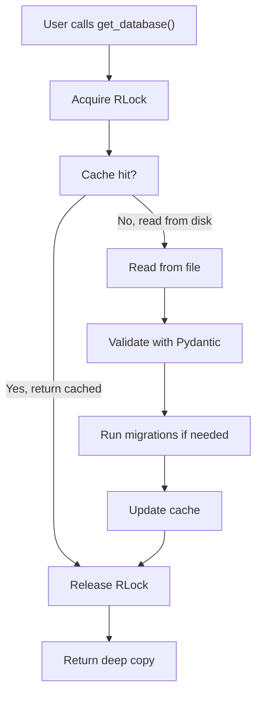
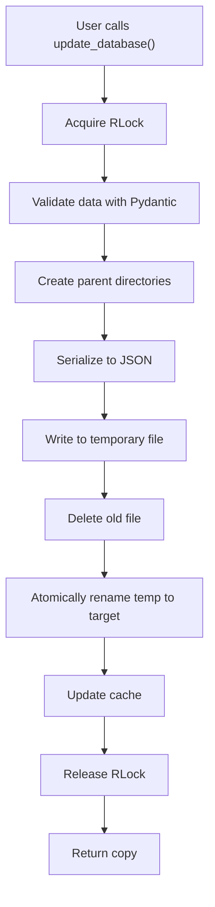

# Architecture & Design

This document explains the internal design of JsonDatabase and JsonCollection, how they work, and how to extend them.

## Components Overview

Jays Tools provides two complementary components:

### JsonDatabase

Single-entity storage for application state, configuration, or unified data structures. All data is stored in one JSON file.

**Use when**: You have one main data structure (settings, app state, config) that you read/write as a unit.

### JsonCollection

Directory-based multi-entity storage where each entity is stored as an individual JSON file, keyed by filename.

**Use when**: You manage multiple related objects (users, sessions, documents) and need to perform CRUD operations on individual items.

## Design Paradigm

Both components follow a **typed repository pattern** with managed read-modify-write cycles.

### Core Principles

**Repository Pattern**: Both act as strongly-typed repositories, abstracting away file I/O and validation concerns.

**Type Safety**: All data flows through Pydantic models, ensuring compile-time and runtime validation. You never work with unstructured dictionaries.

**Single-Process Focus**: Designed for applications where one process owns the data. Thread-safe in-process locking prevents concurrent access issues, but not intended for multi-process scenarios.

**Immutable-by-Default**: Methods return deep copies, preventing accidental mutations of internal state.

## JsonDatabase Architecture

### Class Hierarchy

```
JsonDatabase (Generic[T])
├── Factory function: creates _JsonDatabase instances
│
_JsonDatabase (Generic[T])
├── Handles file I/O with atomic writes
├── Manages in-memory cache
├── Coordinates validation and migrations
└── Provides sync and async methods with threading.RLock()
```

### Data Flow: Read Operation



### Write Path: Atomic Writes



### Thread Safety Implementation

JsonDatabase uses `threading.RLock()` (reentrant lock) to ensure thread-safe operations:

- **RLock over Lock**: Reentrant design allows the same thread to acquire the lock multiple times (needed because `read()` calls `write()` internally)
- **Atomic file writes**: Temp file → atomic rename prevents corruption if processes crash mid-write
- **Read-modify-write safety**: Lock ensures only one operation at a time per database instance
- **Per-instance locking**: Each JsonDatabase instance has its own lock (no global locks)

**Important limitation**: Locks are per-process only. Multiple processes accessing the same file will not be synchronized and may corrupt data. Use proper databases (PostgreSQL, SQLite) for multi-process access.

## JsonCollection Architecture

### File Organization

```
collection_directory/
├── entity_key_1.json
├── entity_key_2.json
├── entity_key_3.json
└── another_entity.json
```

Each entity is stored as a separate JSON file, named `{key}.json`.

### Internal Design

```
JsonCollection (Generic[T])
├── Factory function: creates _JsonCollection instances
│
_JsonCollection (Generic[T])
├── Manages collection directory
├── Returns JsonDatabase instances for individual entities
├── Coordinates async operations with asyncio.Lock()
└── Provides collection-level operations:
    ├── CRUD: create, get, update, delete
    ├── Queries: exists, list_keys
    ├── Bulk: get_all, update_all, clear
    └── Async variants for all operations
```

### Key Method: `get(key)`

The `get(key)` method returns a **JsonDatabase instance** for a specific entity:

```python
collection = JsonCollection("data/users", model=User)

# Returns a JsonDatabase[User] for this specific entity
user_db = collection.get("alice_id")

# Now you can use JsonDatabase methods
alice = user_db.get_database()
alice.email = "newemail@example.com"
user_db.update_database(alice)
```

This design allows JsonCollection to leverage all of JsonDatabase's features (validation, migrations, atomic writes) per entity.

### Concurrency in JsonCollection

JsonCollection uses `asyncio.Lock()` for async operations:

- **Lock scope**: Per collection instance, protects async operations
- **Serialization**: Concurrent async calls are queued and executed sequentially
- **Per-entity thread safety**: Each entity (via JsonDatabase) gets its own RLock for file I/O

## Migrations

JsonDatabase supports automatic, zero-downtime migrations through a linear versioning chain.

### How Migrations Work

1. **Define Versions**: Create model versions with `previous_model=` parameter
2. **Implement Transform**: Provide `migrate_from_previous()` staticmethod
3. **Automatic Application**: When you load data, migrations run in order

### Migration Chain Example

```python
from typing import Any
from jays_tools.json_database.models import MigratableModel

# Original version
class UserV1(MigratableModel):
    name: str = ""
    age: int = 0

# Add email field
class UserV2(MigratableModel, previous_model=UserV1):
    name: str = ""
    age: int = 0
    email: str = ""

    @staticmethod
    def migrate_from_previous(previous_data: dict[str, Any]) -> dict[str, Any]:
        previous_data["email"] = ""
        return previous_data

# Add verification status
class UserV3(MigratableModel, previous_model=UserV2):
    name: str = ""
    age: int = 0
    email: str = ""
    is_verified: bool = False

    @staticmethod
    def migrate_from_previous(previous_data: dict[str, Any]) -> dict[str, Any]:
        previous_data["is_verified"] = False
        return previous_data
```

When you load `UserV3` data originally in `UserV1` format:
- Version chain is detected: V1 → V2 → V3
- V1→V2 migration runs (add email)
- V2→V3 migration runs (add is_verified)
- Result is valid V3 data

### When to Version

**Version your model when**:
- Code is in production with existing data
- You need incompatible schema changes
- You want automatic data migration

**Don't version during development**:
- Freely modify your single model
- Versioning adds complexity not yet needed
- Create versions only when you have production data

## Async Implementation

JsonDatabase provides async versions using `asyncio.to_thread()`, which runs sync I/O in a thread pool without blocking the event loop.

### Async Methods

```python
# Async read
async def async_get_database(self) -> T:
    async with self.get_lock():
        return await asyncio.to_thread(self.get_database)

# Async write
async def async_update_database(self, data: T) -> T:
    async with self.get_lock():
        return await asyncio.to_thread(self.update_database, data)
```

### Lock Management

The `asyncio.Lock` ensures serialized access:
- Multiple concurrent async calls are queued
- Only one read/write happens at a time
- Prevents race conditions in async contexts

**Note**: Mixing sync and async operations in the same process is safe but means they don't share lock semantics. The lock protects async calls from each other, but sync calls are unprotected.

## Caching Strategy

### Why Cache?

Prevents repeated disk reads for the same data, improving performance for read-heavy workloads.

### How It Works

```python
# First call: reads from disk
data1 = db.get_database()  # Slow - disk I/O

# Subsequent calls: use cache
data2 = db.get_database()  # Fast - in-memory

# After update: cache invalidates
db.update_database(new_data)
data3 = db.get_database()  # Cache updated
```

### Cache Limitations

- **Single-process only**: Different processes have independent caches (no coherence)
- **Not shared**: Each `JsonDatabase` instance has its own cache
- **Memory-based**: Survives until instance is garbage collected

## Deep Copy Semantics

Every returned value is a deep copy to prevent accidental mutations:

```python
db = JsonDatabase("users.json", Users)

# Get a copy
users = db.get_database()

# Mutate it (safe - doesn't affect cache)
users.users.append(new_user)

# Get again - original is unchanged
users2 = db.get_database()
assert len(users2.users) == len(original_users)
```

This is crucial for working with nested structures (lists, dicts) where shallow copies would share references.

## File I/O

### Format

- **Format**: JSON (UTF-8 by default)
- **Indentation**: 4 spaces (human-readable)
- **Encoding**: UTF-8 strict (or configurable fallbacks)
- **Line Endings**: Unix (`\n`, not Windows `\r\n`)

### Example File

```json
{
    "total": 2,
    "users": [
        {
            "id": 1,
            "name": "Alice"
        },
        {
            "id": 2,
            "name": "Bob"
        }
    ]
}
```

### Error Handling

- **Missing file**: Creates new file with default model instance
- **Empty file**: Creates new file with default model instance
- **Invalid JSON**: Raises `ValueError` with parsing details
- **Validation error**: Raises `ValueError` with validation details
- **Codec error**: Tries fallback encodings, then raises with list of attempts

## Limitations & Design Tradeoffs

### Not Suitable For

- **Multi-process access**: Use proper databases (PostgreSQL, SQLite)
- **High-concurrency scenarios**: Use Redis, MongoDB, or similar
- **Large datasets**: Loads entire database into memory
- **Network sharing**: Data is local file-system only

### Design Tradeoffs

| Aspect | JsonDatabase/JsonCollection | Traditional DB |
|--------|---|---|
| **Setup** | None, just files | Complex setup required |
| **Type Safety** | Full (Pydantic) | Partial or none |
| **Performance** | Fast for small data | Optimized for scale |
| **Scaling** | Doesn't scale | Scales well |
| **Migrations** | Automatic (built-in) | Manual scripts |
| **Ideal Use Case** | Local app data, prototypes | Production services |

## Implemented Features

✅ **Atomic writes** — Temp file + atomic rename prevents corruption during concurrent writes
✅ **Thread-safe operations** — RLock serializes file I/O per instance
✅ **Automatic migrations** — Schema versioning with linear migration chains
✅ **Async support** — Non-blocking I/O via thread pool
✅ **Deep copy semantics** — Prevents accidental cache mutations
✅ **In-memory caching** — Fast reads for unchanged data
✅ **Comprehensive testing** — 91 tests covering all operations and edge cases

## Future Enhancements

Potential improvements under consideration:

- **Encryption**: Optional AES encryption at rest
- **Compression**: Optional gzip for large collections
- **Schema validation hooks**: Custom validation beyond Pydantic
- **Backup/restore utilities**: Built-in snapshot and recovery tools
