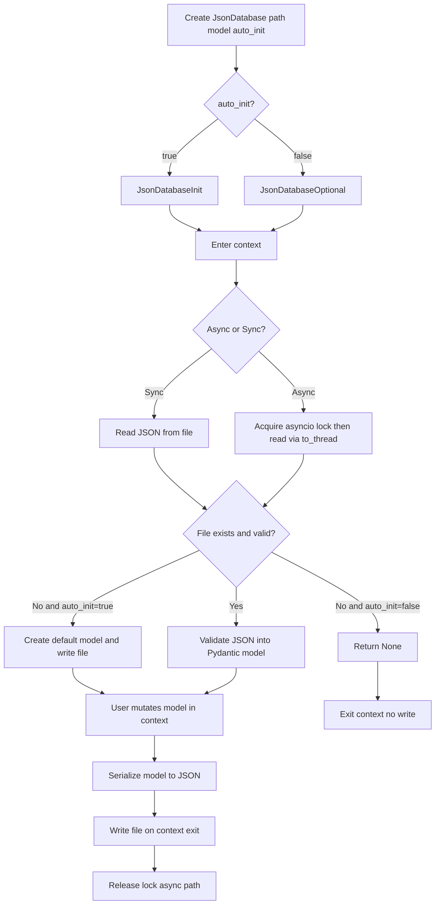

# Jay Tools

This package is a collection of tools that I tend to find useful in my projects. It is not meant to be a comprehensive library, but rather a collection of utilities that I find useful.

## Installation
You can install the package via pip:

```bash
pip install jays-tools
```

## Tools

### JsonDatabase

A lightweight JSON-backed database with Pydantic validation and type hints. Perfect for small projects, embedded data stores, or prototypes where you want structured data without the complexity of traditional databases.

#### Inspiration

I love tools like SQL, Redis, and other databases for live production data 
where multiple users are interacting with the same data simultaneously. 
However, my frustrations were the typing overhead, writing exhaustive tests 
just to validate schemas, and the complexity that comes with it when all I 
need is a simple way to store data in a project.

SQLAlchemy is powerful but can get heavy and overwhelming fast. SQLModel is 
a step in the right direction, but it has its rough edges — some features 
require workarounds that feel more like hacks than solutions.

The database I enjoyed most was TinyDB. It lacked typing support, but the 
concept and API were exactly what I wanted — especially for projects like 
Local osu! Server, where only a single user is ever interacting with the data.

So I built this: a simple JSON database with the full benefits of Pydantic 
models, type hints, and surprisingly painless migrations — all without the 
overhead of a traditional database setup.

#### Usage

```python
from jays_tools.json_database import JsonDatabase
from pydantic import BaseModel

class User(BaseModel):
    id: int
    name: str

class Users(BaseModel):
    total: int = 0
    users: list[User] = []

# Create or load database. auto_init=True creates file if it doesn't exist
db = JsonDatabase("users.json", Users, auto_init=True)

# Sync usage - acquires lock, reads, modifies, writes on exit
with db as users_data:
    users_data.users.append(User(id=1, name="Jay"))
    users_data.users.append(User(id=2, name="John"))
    users_data.total = len(users_data.users)
    # Automatically writes on context exit

# Async usage - same pattern, non-blocking I/O via thread pool
async with db as users_data:
    if users_data is not None:
        users_data.users.append(User(id=3, name="Jane"))
        users_data.total = len(users_data.users)
        # Automatically writes on context exit
```

#### Design Philosophy

JsonDatabase is intentionally designed for single-project, low-ceremony persistence where code clarity matters more than feature depth.

The core principles are:

- Strongly typed data first: your database shape is defined with Pydantic models, so validation and editor hints are built in.
- Minimal API surface: one entry point (`JsonDatabase`) with context-manager based read/modify/write behavior.
- Predictable lifecycle: open context, mutate in memory, auto-persist on exit.
- Safe-by-default validation: corrupted or incompatible JSON raises clear errors, with optional backup snapshots.
- Practical over perfect: optimized for local app data and prototypes, not high-concurrency or distributed workloads.

This keeps the tool simple enough to reason about while still giving you structure, typing, and migration-friendly model evolution.

#### Architecture & Paradigm

JsonDatabase follows a typed repository-style pattern with context-managed units of work.

- Factory pattern: `JsonDatabase(...)` returns either `JsonDatabaseInit` or `JsonDatabaseOptional` based on `auto_init`.
- Context manager paradigm:
    - Sync: `with db as data:`
    - Async: `async with db as data:` (internally uses `asyncio.to_thread` for file I/O)
- Validation boundary: JSON is parsed into a Pydantic model on read, and serialized from that model on write.
- File abstraction: `JsonFile` normalizes paths and enforces `.json` extension.
- Locking model: an in-process asyncio lock is used for async access per file path.



