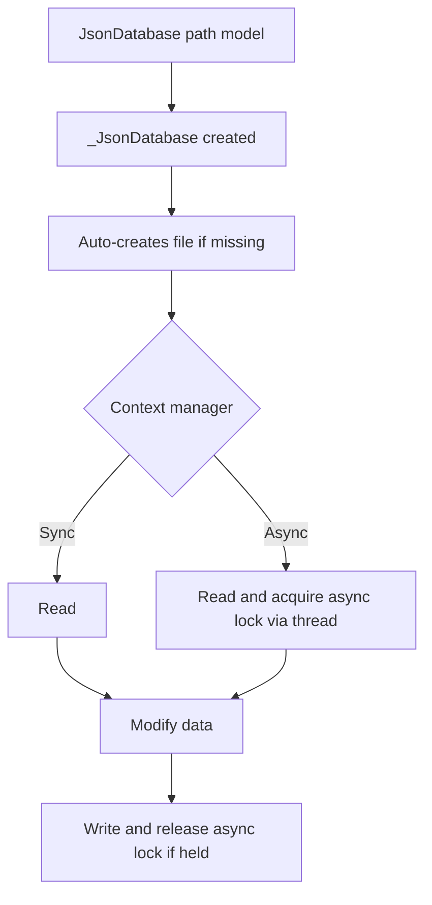

# Jay Tools

This package is a collection of tools that I tend to find useful in my projects. It is not meant to be a comprehensive library, but rather a collection of utilities that I find useful.

## Installation
You can install the package via pip:

```bash
pip install jays-tools
```

## Tools

### JsonDatabase

A lightweight JSON-backed database with Pydantic validation and type hints. Perfect for small projects, embedded data stores, or prototypes where you want structured data without the complexity of traditional databases.

#### Inspiration

I love tools like SQL, Redis, and other databases for live production data 
where multiple users are interacting with the same data simultaneously. 
However, my frustrations were the typing overhead, writing exhaustive tests 
just to validate schemas, and the complexity that comes with it when all I 
need is a simple way to store data in a project.

SQLAlchemy is powerful but can get heavy and overwhelming fast. SQLModel is 
a step in the right direction, but it has its rough edges — some features 
require workarounds that feel more like hacks than solutions.

The database I enjoyed most was TinyDB. It lacked typing support, but the 
concept and API were exactly what I wanted — especially for projects like 
Local osu! Server, where only a single user is ever interacting with the data.

So I built this: a simple JSON database with the full benefits of Pydantic 
models, type hints, and surprisingly painless migrations — all without the 
overhead of a traditional database setup.

#### Usage

```python
from jays_tools.json_database import JsonDatabase
from pydantic import BaseModel

class User(BaseModel):
    id: int
    name: str

class Users(BaseModel):
    total: int = 0
    users: list[User] = []

# Create database. File is auto-created if it doesn't exist.
db = JsonDatabase("users.json", Users)

# Sync usage - reads, modifies, writes on exit
with db as users_data:
    users_data.users.append(User(id=1, name="Jay"))
    users_data.users.append(User(id=2, name="John"))
    users_data.total = len(users_data.users)
    # Automatically writes on context exit

# Async usage - acquires lock, same pattern, non-blocking I/O via thread pool
async with db as users_data:
    users_data.users.append(User(id=3, name="Jane"))
    users_data.total = len(users_data.users)
    # Automatically writes on context exit
```

#### Design Philosophy

JsonDatabase is intentionally designed for single-project, low-ceremony persistence where code clarity matters more than feature depth.

The core principles are:

- Strongly typed, never None: your database shape is defined with Pydantic models; the context manager always returns a valid instance, so no null-checking required.
- Minimal API surface: one entry point (`JsonDatabase`) with context-manager based read/modify/write behavior — no extra methods to learn.
- Predictable lifecycle: enter context, mutate in memory, auto-persist on exit. Basic in-process locking is provided for async access, but it is not intended for multi-process or high-concurrency scenarios.
- Transparent migrations: upgrade your model definition and existing data automatically migrates on load. No manual migration scripts.
- Safe-by-default validation: corrupted or incompatible JSON raises clear errors, with optional backup snapshots before corruption is attempted.
- Practical over perfect: optimized for local app data and prototypes where a single process owns the data, not high-concurrency or distributed workloads.

This keeps the tool simple enough to reason about while still providing structure, typing, and painless model evolution.

#### Architecture & Paradigm

JsonDatabase follows a typed repository-style pattern with context-managed units of work. The main class, `JsonDatabase`, serves as a factory for creating context managers that handle the lifecycle of reading, modifying, and writing JSON data. The internal class, `_JsonDatabase`, encapsulates the actual logic for file I/O, basic in-process locking, and validation. The user interacts with `JsonDatabase` to define their data model and file path, and then uses the context manager to work with the data in a safe, structured way. The design abstracts away most of the file-handling details and provides simple, in-process concurrency control, but does not aim to offer cross-process or high-concurrency guarantees, allowing users to focus on their data models and business logic. 



#### Migrations

Define model versions as a linear chain using `previous_model=` parameter. When you create a new version, declare the previous version and implement the `migrate_from_previous()` staticmethod to transform old data.

**When to version your model:** Only create a new version class (like `UserV2`) when your code is in production and you need to ensure existing data continues to work smoothly. During development, feel free to modify your single model directly. Versioning is for supporting legacy data when you must change the schema in incompatible ways.

```python
from typing import Any
from jays_tools.json_database import JsonDatabase, MigratableModel

class UserV1(MigratableModel):
    name: str = ""
    age: int = 0

class UserV2(MigratableModel, previous_model=UserV1):
    name: str = ""
    age: int = 0
    email: str = ""  # New field

    @staticmethod
    def migrate_from_previous(previous_data: dict[str, Any]) -> dict[str, Any]:
        """Migrate from UserV1 to UserV2: add email field"""
        previous_data["email"] = ""  # Default for existing records
        return previous_data

class UserV3(MigratableModel, previous_model=UserV2):
    name: str = ""
    age: int = 0
    email: str = ""
    is_active: bool = True  # New field

    @staticmethod
    def migrate_from_previous(previous_data: dict[str, Any]) -> dict[str, Any]:
        """Migrate from UserV2 to UserV3: add is_active field"""
        previous_data["is_active"] = True
        return previous_data

# Load V1 data as V3 — migrations apply automatically in order
db = JsonDatabase("user.json", UserV3)
with db as user:
    print(user.model_version)  # Output: 3
    print(user.email)           # Output: "" (from V2 migration)
    print(user.is_active)       # Output: True (from V3 migration)
```

#### Recommended Project Structure

For larger projects with multiple models, organize them in a dedicated `models/` folder with one file per entity:

```
my_project/
├── src/
│   ├── models/
│   │   ├── __init__.py
│   │   ├── user.py
│   │   ├── settings.py
│   │   └── session.py
│   ├── database.py
│   └── main.py
└── data/
    ├── user.json
    ├── settings.json
    └── session.json
```

**models/user.py:**
```python
from typing import Any
from jays_tools.json_database.models import MigratableModel

class UserV1(MigratableModel):
    name: str = ""
    age: int = 0

class UserV2(MigratableModel, previous_model=UserV1):
    name: str = ""
    age: int = 0
    email: str = ""

    @staticmethod
    def migrate_from_previous(previous_data: dict[str, Any]) -> dict[str, Any]:
        """Migrate from UserV1 to UserV2: add email field"""
        previous_data["email"] = ""
        return previous_data

class UserV3(MigratableModel, previous_model=UserV2):
    name: str = ""
    age: int = 0
    email: str = ""
    is_verified: bool = False

    @staticmethod
    def migrate_from_previous(previous_data: dict[str, Any]) -> dict[str, Any]:
        """Migrate from UserV2 to UserV3: add is_verified field"""
        previous_data["is_verified"] = False
        return previous_data

# Use the latest version when creating databases
CurrentUser = UserV3
```

**src/database.py:**
```python
from pathlib import Path
from src.models.user import CurrentUser as User
from src.models.settings import CurrentSettings as Settings
from jays_tools.json_database import JsonDatabase

DATA_DIR = Path("data")
DATA_DIR.mkdir(exist_ok=True)

user_db = JsonDatabase(DATA_DIR / "user.json", User)
settings_db = JsonDatabase(DATA_DIR / "settings.json", Settings)
```

**src/main.py:**
```python
from src.database import user_db

def main():
    # Automatically loads and migrates data if needed
    with user_db as user:
        user.name = "Alice"
        user.email = "alice@example.com"
        user.is_verified = True
        # Auto-saves on exit

if __name__ == "__main__":
    main()
```